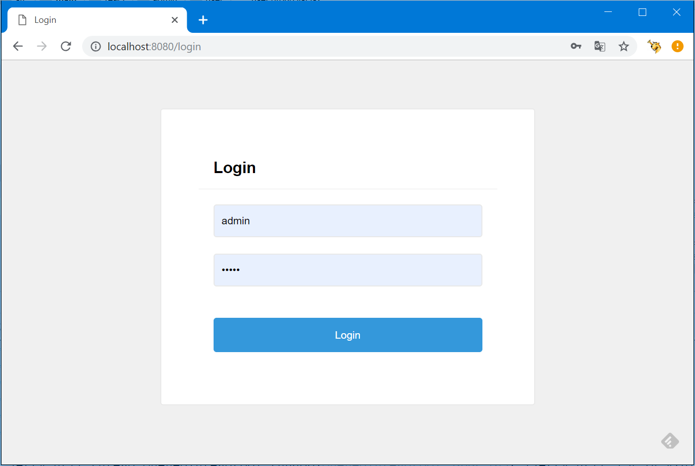
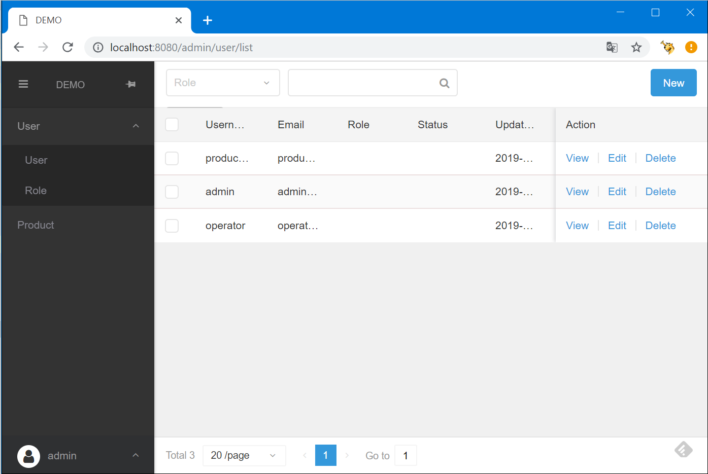

# Spring Demo Project

The demo project is showcase of Spring + React integration with basic CRUD with ACL support. 
 
[](https://travis-ci.com/chifei/spring-demo-project)
[](https://codecov.io/gh/chifei/spring-demo-project)
[](https://lgtm.com/projects/g/chifei/spring-demo-project/context:java)
[](https://lgtm.com/projects/g/chifei/spring-demo-project/alerts)


## Frameworks

- Spring boot
- Spring MVC
- Spring messaging
- Spring caching
- Spring data
- JPA with hibernate
- React
- Element UI 
- Junit 5
- Gradle 5

## Features

- User login/logout
- User switch language (i18n for English and Chinese)
- User search user by role or name
- User create or update another user, assign roles.
- User delete another user with batch delete support
- User search role by name
- User create or update another role, assign permissions.
- User delete another role with batch delete support.
- User can only see buttons/menus with permission granted.




## How to test it

- Download standalone jar file [demo-website-2.1.0.jar](https://github.com/chifei/spring-demo-project/releases/download/2.1.0/demo-website-2.1.0.jar)
- Run```java -jar demo-website-2.1.0.jar```

The standalone jar is packaged with HSQL embedded.

## Dependencies
```
 compile 'javax.inject:javax.inject:1'
compile 'com.google.guava:guava:27.0.1-jre'
compile "org.springframework:spring-context:${springVersion}"
compile "org.springframework:spring-webmvc:${springVersion}"
compile "org.springframework.boot:spring-boot-starter-web:${springBootVersion}"
compile "org.springframework.boot:spring-boot-starter-activemq:${springBootVersion}"
compile "org.springframework.boot:spring-boot-starter-data-jpa:${springBootVersion}"
compile 'org.springframework.data:spring-data-jpa:2.1.4.RELEASE'
compile 'org.hibernate:hibernate-core:5.4.1.Final'
compile 'com.fasterxml.jackson.module:jackson-module-jaxb-annotations:2.9.8'
compile 'org.hsqldb:hsqldb:2.3.2'
compile 'org.thymeleaf:thymeleaf-spring4:2.1.4.RELEASE'
compile 'org.apache.activemq:activemq-broker:5.15.8'
compile 'com.opencsv:opencsv:4.4'
compile 'org.apache.logging.log4j:log4j-to-slf4j:2.11.1'
compile 'org.slf4j:jul-to-slf4j:1.7.25'
```

## ACL implementation

- @LoginRequired and @PermissionRequired
- Corresponding LoginRequiredInterceptor and PermissionRequiredInterceptor
- React PermissionRequired Component

```java

@RequestMapping(value = "/admin/api/user/find", method = RequestMethod.PUT)
    @PermissionRequired("user.read")
    public UserQueryResponse find(@RequestBody UserQuery userQuery) {
        UserQueryResponse userQueryResponse = new UserQueryResponse();
        userQueryResponse.items = items(userService.find(userQuery));
        userQueryResponse.page = userQuery.page;
        userQueryResponse.limit = userQuery.limit;
        userQueryResponse.total = userService.count(userQuery);
        return userQueryResponse;
    }

    @RequestMapping(value = "/admin/api/user", method = RequestMethod.POST)
    @PermissionRequired("user.write")
    public UserResponse create(@RequestBody CreateUserRequest request) {
        request.requestBy = userInfo.username();
        return response(userService.create(request));
    }

```

```javascript
<PermissionRequired permissions={["user.write"]}>
    <Button type="text"> <Link to={{pathname: "/admin/user/role/" + data.id + "/update"}}>{i18n.t("user.update")}</Link> </Button>
</PermissionRequired>
<PermissionRequired permissions={["user.write"]}>
    <Button onClick={e => this.delete(data, e)} type="text">{i18n.t("user.delete")}</Button>
</PermissionRequired>
```


